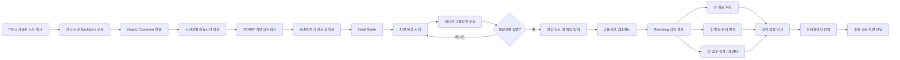
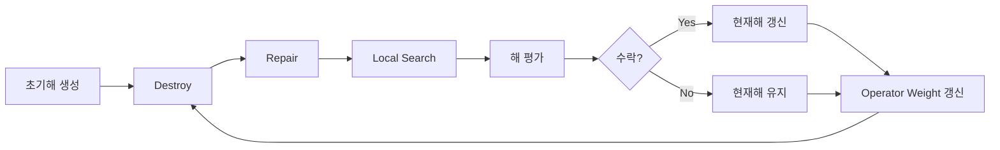

# MOVE AI 2026 - VCM

## 실시간 교통 정보를 반영한 차량 경로 재최적화 시스템

현대글로비스 **MOVE AI Challenge 2026**
**Team VCM**

본 프로젝트는 물류 차량의 초기 배송 경로를 최적화하고, 운행 중 발생하는 **교통사고·돌발상황·교통 정체 등 실시간 교통 변화에 대응하여 차량 경로를 재최적화하는 의사결정 지원 시스템**입니다.

기존의 정적인 차량 경로 계획에서 나아가,

1. 시간대별 교통상황을 고려한 **초기 운송 계획 수립**
2. 실시간 교통 및 돌발상황 **모니터링**
3. 사고 또는 정체 발생 시 영향 차량 **탐지**
4. 상황에 따른 여러 **Rerouting 대안 생성**
5. 의사결정자가 대안을 비교하고 선택
6. 선택된 수정 경로를 차량 운영계획에 반영

하는 전체 과정을 하나의 **Dynamic Fleet Control Tower**에서 수행하는 것을 목표로 합니다.

---

# 1. 프로젝트 개요

물류 차량의 운송계획은 출발 시점에 최적의 경로를 생성하는 것만으로 충분하지 않습니다.

실제 도로에서는 운행 도중 다음과 같은 상황이 지속적으로 발생할 수 있습니다.

* 교통사고
* 도로 정체
* 공사 및 차선 통제
* 기상 악화
* 특정 구간의 예상치 못한 이동시간 증가

이러한 상황이 발생하면 기존 최적 경로가 더 이상 최적이지 않을 수 있으며, 배송 지연과 추가 운송비용이 발생합니다.

VCM은 이를 해결하기 위해 **Time-Dependent Multi-Depot Vehicle Routing Problem with Time Windows(TD-MDVRPTW)**를 기반으로 초기 운송계획을 생성하고, 실시간 교통상황 변화가 발생하면 해당 정보를 도로 네트워크에 반영하여 경로를 다시 평가합니다.

---

# 2. 전체 시스템 흐름



---

# 3. 핵심 기능

## 3.1 Initial Route 생성

운행 시작 전 **ALNS(Adaptive Large Neighborhood Search)**를 이용하여 초기 차량 경로를 생성합니다.

사용자는 웹 애플리케이션에서 운영 목적에 맞게 최적화 조건을 설정할 수 있습니다.

### 설정 가능한 항목

* 최적화 목표
* 배차 트럭 수
* 출발 Depot
* Time Window 중요도
* 차량 적재용량 제한
* 교통 데이터 반영 여부

### 운영 목표

웹 애플리케이션에서는 사용자에게 이해하기 쉬운 형태로 다음과 같은 운영 목표를 제공합니다.

**균형 설정**

* 이동시간
* 운영비용
* 배송지연

등을 종합적으로 고려하는 운영 시나리오입니다.

**빠른 배송**

* 총 이동시간 감소를 중요하게 고려합니다.

**고객 만족도**

* 고객 Time Window와 배송 지연 감소를 중요하게 고려합니다.

**비용 절감**

* 운행 차량 수와 총 이동거리 감소를 중요하게 고려합니다.

백엔드 ALNS에서는 다음 네 가지 단일 목적함수를 독립적으로 사용할 수 있습니다.

```text
TARDINESS
TRAVEL_TIME
DISTANCE
VEHICLE_COST
```

즉, 사용자가 선택한 운영 목적에 따라 적합한 평가 기준을 적용하여 차량의

* 고객 할당
* 고객 방문 순서
* 사용 차량
* 최종 도착 Depot

을 최적화합니다.

---

# 4. 시간대별 교통상황 반영

본 프로젝트는 단순한 거리 기반 VRP가 아니라 **시간대에 따라 이동시간이 변하는 TDVRP**를 사용합니다.

예를 들어 동일한 구간

```text
A → B
```

라도 출발 시간이 다르면 이동시간이 달라질 수 있습니다.

```text
08:00 출발 → 32분
09:00 출발 → 47분
10:00 출발 → 39분
```

이를 위해 각 도로 Edge별로 시간대별 이동시간을 관리합니다.

```text
edge_id
hour
travel_time_min
speed_kph
data_source
```

현재 기본 네트워크에서는 **06:00부터 22:00까지 1시간 단위 Snapshot**을 사용합니다.

차량이 특정 시간대에 출발하면 해당 시간대의 도로 가중치를 이용해 최단경로와 이동시간을 계산합니다.

---

# 5. 도로 네트워크

## 5.1 데이터

도로 네트워크는 국토교통부 ITS 국가표준 **NODELINKDATA**를 기반으로 구축합니다.

원본 전국 도로 네트워크 전체를 VRP가 직접 탐색할 경우 계산량이 지나치게 커질 수 있으므로 주요 도로 연결 구조를 보존하면서 네트워크를 단순화합니다.

### 구축 과정

```text
ITS NODELINKDATA
        ↓
고속도로 / 도시고속도로 / 주요 일반국도 추출
        ↓
주요 IC / JCT / 분기점 유지
        ↓
단순 통과 노드 축소
        ↓
도로 Backbone 생성
        ↓
Depot / Customer 연결
        ↓
Physical Network 생성
        ↓
시간대별 Edge 이동시간 생성
        ↓
TDVRP Virtual Network 생성
```

---

## 5.2 Physical Network

현재 구축된 Physical Network는 다음과 같습니다.

```text
Physical Node : 255개
 ├─ ROAD     : 200개
 ├─ DEPOT    : 5개
 └─ CUSTOMER : 50개

Directed Edge : 1,528개
```

Depot과 Customer는 실제 Backbone의 인접 도로 노드와 Connector Edge로 연결됩니다.

---

# 6. Physical Network와 TDVRP Network

최적화 알고리즘이 매번 255개의 Physical Node 전체에서 최단경로를 계산하지 않도록 **Service Node 기반 Virtual Network**를 별도로 구성합니다.

Service Node는

```text
Depot 5개
+
Customer 50개
=
총 55개
```

입니다.

따라서 ALNS와 MILP는 55개의 Service Node를 대상으로 문제를 해결합니다.

예를 들어

```text
C001 → C007
```

이라는 TDVRP Arc는 실제 도로에서 하나의 Edge가 아닙니다.

실제로는 다음과 같은 Physical Path가 될 수 있습니다.

```text
C001
 ↓
R017
 ↓
R042
 ↓
R061
 ↓
C007
```

이 경로와 이동시간은 사전에 계산하여 저장합니다.

### `td_od_matrix.csv`

최적화 알고리즘에서 사용하는 OD 이동시간입니다.

```text
from_node
to_node
hour
travel_time_min
distance_km
```

### `td_paths.csv`

실제 도로 경로 복원이 필요한 Rerouting 단계에서 사용합니다.

```text
from_node
to_node
hour
travel_time_min
distance_km
path_nodes
path_edges
```

---

# 7. 현재 TDVRP Network 규모

현재 생성된 네트워크는 다음과 같습니다.

```text
Physical Nodes        : 255
Physical Directed Edge: 1,528

Service Nodes         : 55
 ├─ Depot             : 5
 └─ Customer          : 50

시간대                 : 17개
운영시간               : 06:00 ~ 22:00

OD-Hour Entry          : 50,490
Unreachable OD Pair    : 0
```

즉,

```text
55 × 54 × 17 = 50,490
```

개의 시간대별 OD 이동시간을 ALNS가 Lookup 방식으로 사용할 수 있습니다.

---

# 8. 차량경로 최적화 문제

본 프로젝트의 기본 문제는 **TD-MDVRPTW**입니다.

주요 의사결정은 다음과 같습니다.

* 어떤 차량을 사용할 것인가
* 어떤 고객을 어떤 차량에 할당할 것인가
* 각 차량이 고객을 어떤 순서로 방문할 것인가
* 각 구간을 어느 시간대에 출발하는가
* 차량이 마지막 작업 후 어느 Depot으로 이동할 것인가

각 차량은 정해진 출발 Depot에서 출발하지만 반드시 동일한 Depot으로 돌아올 필요는 없습니다.

즉,

```text
고정 출발 Depot
    ↓
Customer
    ↓
Customer
    ↓
...
    ↓
선택 가능한 종료 Depot
```

형태의 **Flexible End Depot** 구조를 사용합니다.

---

# 9. 주요 제약조건

최적화 과정에서는 다음 조건을 고려합니다.

* 모든 고객은 정확히 한 번 서비스
* 차량 용량 제한
* 차량별 고객 할당
* 고객 방문 순서
* 고객 Time Window
* 차량 운행 가능시간
* 시간대별 이동시간
* 경로 연결 가능성
* 출발 Depot
* 종료 Depot
* 차량 사용 여부

기본 Time Window 모드는 `SOFT`입니다.

따라서 Time Window를 초과하더라도 경로 자체를 불가능한 것으로 처리하지 않고 **Tardiness**로 계산합니다.

필요한 경우

```bash
--time-window-mode HARD
```

를 사용하여 Time Window 위반을 허용하지 않는 문제도 실행할 수 있습니다.

---

# 10. ALNS

대규모 문제를 빠르게 해결하기 위해 **Adaptive Large Neighborhood Search(ALNS)**를 사용합니다.

ALNS는 초기해를 생성한 뒤 일부 고객의 배치 또는 순서를 제거하고 다시 삽입하는 과정을 반복하면서 해를 개선합니다.



ALNS는 선택된 목적함수를 기준으로

* 후보해 평가
* Simulated Annealing 수락
* Operator Reward
* Insertion 평가
* Local Search

를 수행합니다.

---

# 11. 실시간 교통 및 돌발상황 감지

Initial Route가 생성된 이후 차량 운행 중에는 새로운 교통정보가 발생할 수 있습니다.

시스템은 이러한 돌발상황을 도로 Link와 연결하여 기존 Physical Network의 이동시간을 수정할 수 있도록 설계되어 있습니다.

지원하는 대표적인 정보는 다음과 같습니다.

* 교통사고
* 교통 정체
* 도로 통제
* 기상 변화
* 예상 지연시간
* 영향 차량

웹 기반 Control Tower에서는 돌발상황 발생 시

* 사고 위치
* 사고 유형
* 위험도
* 영향받는 차량
* 현재 차량 상태
* 예상 지연시간

등을 확인할 수 있습니다.

---

# 12. 실시간 그래프 업데이트

돌발상황이 발생하면 다음 절차를 수행합니다.

```text
실시간 교통 이벤트
        ↓
UTIC Link ID 확인
        ↓
Physical Edge와 매칭
        ↓
해당 Edge의 이동시간 수정
        ↓
시간대별 Edge Profile 업데이트
        ↓
Shortest Path 재계산
        ↓
TD OD Matrix 업데이트
        ↓
Rerouting 실행
```

UTIC의 `linkId` 또는 `lineLinkId`는 Physical Edge에 저장된 원본 ITS Link ID와 연결됩니다.

여러 사고가 동시에 발생하는 경우에도 동일한 시간대의 도로 Edge Profile에 함께 반영할 수 있습니다.

---

# 13. Rerouting

돌발상황 발생 이후 시스템은 기존 계획을 무조건 처음부터 다시 계산하는 대신 **변경 범위가 서로 다른 여러 대응 대안**을 생성합니다.

현재 시스템에서는 세 가지 주요 대안을 비교합니다.

---

## 13.1 경로 우회

**내부 전략명: `DETOUR`**

현재 차량 할당과 고객 방문 순서를 유지합니다.

대신 사고가 발생한 Physical Road를 피해 새로운 도로 경로를 계산합니다.

```text
기존

Depot
  ↓
C01
  ↓
C03
  ↓ 사고구간
C07
  ↓
C09
```

```text
우회 후

Depot
  ↓
C01
  ↓
C03
  ↘
   우회 도로
      ↘
       C07
        ↓
       C09
```

### 특징

* 고객 할당 유지
* 방문 순서 유지
* Physical Path만 변경
* 운송계획 변경 최소화

가장 보수적인 대응 방법입니다.

---

# 14. 방문 순서 변경

**내부 전략명: `REROUTE`**

단순 우회만으로 충분한 개선이 어렵다면 남아 있는 고객의 **방문 순서 자체를 변경**합니다.

예를 들어 기존 경로가

```text
Depot → C01 → C03 → C07 → C09
```

였다면,

```text
Depot → C01 → C09 → C03 → C07
```

과 같이 변경할 수 있습니다.

변경된 TD OD Matrix를 이용하여 Local Search를 수행하고 더 좋은 고객 방문 순서를 탐색합니다.

### 특징

* 기존 차량을 최대한 유지
* 고객 방문 순서 변경 가능
* 사고구간 회피
* 지연 감소 가능
* 기존 운송계획 변경 규모는 DETOUR보다 큼

---

# 15. 업무 승계 / 재배차

**내부 전략명: `NEW_TRUCK`**

사고 또는 심각한 정체로 기존 차량만으로 배송 지연을 해결하기 어렵다면 현재 사용하지 않는 차량을 새롭게 투입할 수 있습니다.

예를 들어

```text
Truck T02
C01 → C03 → C07 → C09
```

에서 T02가 사고로 큰 영향을 받을 경우,

```text
Truck T02
C01 → C03

Truck T05
C07 → C09
```

와 같이 일부 업무를 인근 유휴 차량에 이관할 수 있습니다.

### 특징

* 신규 차량 투입 가능
* 고객 재할당 가능
* 심각한 배송 지연 감소
* 추가 차량 운영비 발생 가능

Rerouting 대안 중 가장 적극적인 대응 방법입니다.

---

# 16. Rerouting 대안 비교

세 가지 전략은 다음 지표를 이용하여 비교할 수 있습니다.

```text
총 배송 지연시간
총 이동시간
총 이동거리
차량 운영비용
사용 차량 수
방문 순서 변경 수
재할당 고객 수
신규 투입 차량 수
Feasibility
```

이를 통해 단순히 가장 빠른 경로를 선택하는 것이 아니라

> **배송 지연 감소 효과와 실제 운영계획 변경 비용 사이의 Trade-off**

를 의사결정자가 확인할 수 있도록 합니다.

시스템에서는 실행 가능한 대안 중

1. 배송 지연
2. 차량 운영비
3. 이동시간
4. 이동거리
5. 기존 계획 변경 규모

등을 기준으로 추천 대안을 선정할 수 있습니다.

---

# 17. Dynamic Fleet Control Tower

최적화 결과와 실시간 Rerouting 결과를 실제 운영자가 쉽게 확인할 수 있도록 웹 기반 **Dynamic Fleet Control Tower**를 구현했습니다.

웹 애플리케이션은 크게 세 개의 화면으로 구성됩니다.

```text
① 통합 관제 Dashboard
② Initial Route
③ Rerouting
```

---

# 18. 통합 관제 Dashboard

Dashboard는 전체 차량 운영 상태를 실시간으로 파악하기 위한 화면입니다.

주요 정보는 다음과 같습니다.

### 운영 KPI

* 운행 중 차량 수
* 총 주문 건수
* 경로 위험 지수
* 총 운행 거리
* 예상 운행시간
* 함대 운영 효율성

### 지도 기반 차량 관제

지도에서

* Depot
* Customer
* 차량 위치
* 차량별 운행 경로
* 사고 위치
* 위험 구간

을 확인할 수 있습니다.

### 실시간 알림

* 교통사고
* 교통 정체
* 기상 상황
* 차량 지연
* 배송 상태

등의 이벤트를 확인할 수 있습니다.

특정 차량을 선택하면

* 현재 운행구간
* 속도
* 적재량
* 적재율
* 예상 도착시간
* 현재 지연시간
* 담당 운송경로

등의 상세정보를 확인할 수 있습니다.

---

# 19. Initial Route 화면

Initial Route 화면에서는 운행 시작 전 최적화 조건을 설정하고 ALNS를 실행할 수 있습니다.

### 설정 항목

```text
최적화 목표
배차 트럭 수
출발 Depot
Time Window 중요도
차량 적재용량
교통 데이터 반영 여부
```

사용자가 조건을 선택하고

```text
최적화 실행
```

버튼을 누르면 ALNS를 이용하여 초기 운송계획을 생성합니다.

---

# 20. Initial Route 결과 확인

최적화가 완료되면 지도에서 차량별 경로를 서로 다른 색으로 확인할 수 있습니다.

차량별로 다음 정보를 확인할 수 있습니다.

* 차량 ID
* 담당 운전자
* 할당 고객
* 고객 방문 순서
* 총 운행거리
* 예상 운행시간
* 적재율
* 출발 Depot
* 종료 Depot

또한 전체 함대에 대해서는

* 총 이동거리
* 총 운행시간
* 사용 차량 수
* 배송 지연 건수

등을 확인할 수 있습니다.

---

# 21. 운행 시뮬레이션

Initial Route 화면에서는 생성된 운송계획을 시간에 따라 확인할 수 있도록 운행 시뮬레이션 기능을 제공합니다.

이를 이용하여 차량이

```text
Depot
 ↓
Customer
 ↓
Customer
 ↓
...
```

를 이동하는 과정을 확인할 수 있습니다.

시간 진행에 따른 차량 위치와 교통상황 변화를 시각적으로 확인할 수 있으며 돌발상황이 발생하면 Rerouting 의사결정으로 연결할 수 있습니다.

---

# 22. Rerouting 화면

돌발상황 발생 시 의사결정자는 Rerouting 화면에서 현재 사고의 영향을 확인하고 대응전략을 선택할 수 있습니다.

### 제공 대안

```text
① 경로 우회
② 방문 순서 변경
③ 업무 승계 / 재배차
```

각 대안별로

* 총 이동거리
* 예상 운행시간
* 감소 가능한 지연시간
* 배송 지연 고객 수
* 추가 운영비
* 기존 경로 대비 변화

등을 비교할 수 있습니다.

의사결정자가 최종 대안을 선택하면 해당 시나리오가 새로운 차량 운영계획에 반영됩니다.

---

# 23. 전체 운영 시나리오

본 시스템이 해결하고자 하는 실제 운영 과정은 다음과 같습니다.

### STEP 1. 운행계획 생성

운영자가

```text
배송목표
배차 차량 수
Depot
Time Window 중요도
```

를 선택합니다.

↓

### STEP 2. ALNS 실행

시간대별 교통상황을 고려하여 차량의

```text
고객 할당
+
방문 순서
+
운행 경로
```

를 결정합니다.

↓

### STEP 3. Initial Route 생성

각 차량에 운송경로를 전달합니다.

↓

### STEP 4. 운행 시작

Control Tower에서 차량 상태를 모니터링합니다.

↓

### STEP 5. 돌발상황 발생

교통사고 또는 정체가 발생합니다.

↓

### STEP 6. 영향 분석

사고 도로를 사용하는 차량과 예상 지연시간을 계산합니다.

↓

### STEP 7. Rerouting

```text
경로 우회
방문 순서 변경
재배차
```

대안을 생성합니다.

↓

### STEP 8. 의사결정

각 전략의 운영성과를 비교합니다.

↓

### STEP 9. 새로운 운송계획 전달

선택된 경로를 차량에 전달하고 운행계획을 갱신합니다.

---

# 24. Demo Instance

현재 Demo Instance는 55개의 Service Node를 기반으로 생성됩니다.

### 고객

고객 Demand는 재현 가능한 Synthetic Data로 생성되며 기본 범위는

```text
4 ~ 20 ton
```

입니다.

### 차량

기본 차량 용량은

```text
30 ton
```

입니다.

Depot별 요구량을 고려하여 필요한 차량 수를 생성합니다.

### Time Window

고객 Time Window는 다음과 같은 업무시간 패턴을 사용합니다.

```text
08:00 - 12:00
09:00 - 15:00
10:00 - 17:00
13:00 - 18:00
08:00 - 16:00
```

---

# 25. MILP

ALNS 결과 검증과 수리모형 구현을 위해 TD-MDVRPTW MILP도 구현되어 있습니다.

주요 Decision Variable은 다음과 같습니다.

```text
x[v,i,j]
차량 v가 i → j를 이동하는지 여부

y[v,i]
고객 i가 차량 v에 할당되는지 여부

z[v]
차량 v를 사용하는지 여부

r[v,d]
차량 v의 종료 Depot이 d인지 여부

lambda[v,i,j,h]
차량 v가 시간대 h에 i → j를 출발하는지 여부

a[v,i]
도착시간

b[v,i]
서비스 시작시간

theta[v,i]
출발시간

T[i]
고객 i의 배송 지연시간
```

Full Instance는 변수와 제약식의 수가 크기 때문에 MILP는 소규모 Instance를 이용한 검증 기능을 함께 제공합니다.

---

# 26. 데이터 처리 Pipeline

```text
ITS NODELINKDATA

↓ src/network/build_backbone.py

data/backbone/
├─ backbone_nodes.csv
└─ backbone_edges.csv

↓ src/network/add_service_nodes.py

data/physical/
├─ physical_nodes.csv
└─ physical_edges.csv

↓ src/network/build_edge_time_profiles.py

data/physical/
└─ edge_time_profiles.csv

↓ src/network/build_tdvrp_graph.py

data/tdvrp/
├─ service_nodes.csv
├─ td_od_matrix.csv
└─ td_paths.csv

↓ src/model/build_demo_instance.py

data/instances/instance_01/
├─ customers.csv
├─ depots.csv
├─ vehicles.csv
└─ parameters.json

↓ ALNS

output/solutions/

↓ 실시간 교통 이벤트

src/rerouting/

↓ Rerouting

DETOUR / REROUTE / NEW_TRUCK
```

---

# 27. 프로젝트 디렉터리

```text
moveAI-VCM/
│
├─ application/
│   └─ 프런트엔드 애플리케이션 소스
│
├─ dynamic-fleet-control-tower/
│   ├─ src/
│   │   ├─ components/
│   │   ├─ data/
│   │   ├─ pages/
│   │   │   ├─ DashboardPage.tsx
│   │   │   ├─ InitialRoutePage.tsx
│   │   │   └─ ReroutePage.tsx
│   │   ├─ App.tsx
│   │   ├─ mockData.ts
│   │   └─ types.ts
│   └─ package.json
│
├─ config/
│   ├─ network.yaml
│   ├─ tdvrp.yaml
│   └─ alns.yaml
│
├─ data/
│   ├─ raw/
│   ├─ backbone/
│   ├─ physical/
│   ├─ tdvrp/
│   └─ instances/
│
├─ docs/
│
├─ output/
│   ├─ solutions/
│   ├─ milp/
│   └─ experiments/
│
├─ src/
│   │
│   ├─ network/
│   │   ├─ inspect_nodelink.py
│   │   ├─ build_backbone.py
│   │   ├─ validate_backbone.py
│   │   ├─ visualize_network.py
│   │   ├─ add_service_nodes.py
│   │   ├─ build_edge_time_profiles.py
│   │   └─ build_tdvrp_graph.py
│   │
│   ├─ model/
│   │   ├─ build_demo_instance.py
│   │   ├─ data_loader.py
│   │   ├─ formulation.py
│   │   ├─ milp_solver.py
│   │   ├─ objective.py
│   │   ├─ problem_data.py
│   │   └─ solution.py
│   │
│   ├─ alns/
│   │   ├─ alns.py
│   │   ├─ initial_solution.py
│   │   ├─ destroy_operators.py
│   │   ├─ repair_operators.py
│   │   ├─ local_search.py
│   │   ├─ evaluation.py
│   │   ├─ acceptance.py
│   │   └─ operator_weights.py
│   │
│   ├─ rerouting/
│   │   ├─ disruption.py
│   │   ├─ traffic_api.py
│   │   ├─ graph_update.py
│   │   ├─ physical_rerouting.py
│   │   ├─ reoptimization.py
│   │   ├─ solution_io.py
│   │   └─ pipeline.py
│   │
│   └─ utils/
│
├─ main.py
├─ requirements.txt
└─ README.md
```

---

# 28. Python 환경 실행

필요 패키지를 설치합니다.

```bash
pip install -r requirements.txt
```

이미 생성된 Backbone을 기준으로 전체 Pipeline을 실행하려면

```bash
python main.py all
```

을 실행합니다.

---

# 29. 단계별 Network 실행

```bash
python -m src.network.inspect_nodelink
python -m src.network.build_backbone
python -m src.network.validate_backbone
python -m src.network.visualize_network
python -m src.network.add_service_nodes
python -m src.network.build_edge_time_profiles
python -m src.network.build_tdvrp_graph
python -m src.model.build_demo_instance
python -m src.model.data_loader
```

Backbone을 처음부터 다시 구축하려면 원본 ITS NODELINKDATA가 필요합니다.

---

# 30. ALNS 실행

배송 지연 최소화:

```bash
python main.py --objective TARDINESS
```

총 이동시간 최소화:

```bash
python main.py --objective TRAVEL_TIME
```

총 이동거리 최소화:

```bash
python main.py --objective DISTANCE
```

차량 운영비 최소화:

```bash
python main.py --objective VEHICLE_COST
```

네 가지 목적함수를 각각 실행하려면

```bash
python main.py --objective ALL
```

을 사용합니다.

Iteration 수를 지정할 수도 있습니다.

```bash
python main.py --objective ALL --iterations 100
```

---

# 31. ALNS 결과

각 목적함수의 결과는 다음 디렉터리에 저장됩니다.

```text
output/solutions/TARDINESS/
├─ best_solution.csv
├─ best_schedule.csv
└─ alns_log.csv
```

동일한 구조로

```text
TRAVEL_TIME
DISTANCE
VEHICLE_COST
```

결과가 저장됩니다.

목적함수별 비교 결과는

```text
output/experiments/objective_comparison.csv
```

에서 확인할 수 있습니다.

---

# 32. MILP 실행

소규모 검증:

```bash
python -m src.model.validate_milp_small
```

Full Instance 예시:

```bash
python main.py milp --objective TARDINESS --time-limit 60 --quiet
```

다른 목적함수도 동일하게 실행할 수 있습니다.

```bash
python main.py milp --objective TRAVEL_TIME --time-limit 60 --quiet
python main.py milp --objective DISTANCE --time-limit 60 --quiet
python main.py milp --objective VEHICLE_COST --time-limit 60 --quiet
```

결과는

```text
output/milp/<OBJECTIVE>/
├─ best_solution.csv
├─ best_schedule.csv
└─ summary.json
```

에 저장됩니다.

---

# 33. 실시간 Rerouting 실행

UTIC 기반 교통 이벤트를 이용하는 경우 API Key를 환경변수로 설정합니다.

```bash
export UTIC_API_KEY="발급받은_API_KEY"
```

이후

```bash
python -m src.rerouting.pipeline \
  --solution output/solutions/TARDINESS/best_solution.csv \
  --provider utic \
  --hours 9 10 \
  --max-new-trucks 3
```

형태로 실행할 수 있습니다.

API Key는 Repository에 직접 저장하지 않습니다.

JSON 형태의 별도 교통 Snapshot을 이용하는 방식도 지원할 수 있도록 구성되어 있습니다.

---

# 34. 웹 애플리케이션 실행

Dynamic Fleet Control Tower로 이동합니다.

```bash
cd dynamic-fleet-control-tower
```

Dependency를 설치합니다.

```bash
npm install
```

개발 서버를 실행합니다.

```bash
npm run dev
```

이후 로컬 브라우저에서 Control Tower를 확인할 수 있습니다.

---

# 35. 주요 설정 파일

### Network

```text
config/network.yaml
```

* 도로 네트워크 설정
* 시간대
* Free-flow Speed
* 시간대별 Congestion Factor

### TDVRP

```text
config/tdvrp.yaml
```

* TDVRP 관련 파라미터

### ALNS

```text
config/alns.yaml
```

* Iteration
* Operator
* Acceptance
* Search 관련 파라미터

를 관리합니다.

---

# 36. 현재 구현 범위

현재 Repository에서는 다음 기능이 구현되어 있습니다.

### 네트워크

* ITS NODELINKDATA 기반 도로 Backbone 생성
* Depot 및 Customer 연결
* Physical Network 생성
* 시간대별 Edge 이동시간 생성
* TDVRP Virtual Network 생성
* Physical Path 저장

### 최적화

* TD-MDVRPTW
* Multi-Depot
* Time Window
* Time-Dependent Travel Time
* Flexible End Depot
* ALNS
* MILP
* 복수 목적함수 독립 실행

### 실시간 대응

* 교통 이벤트 입력
* ITS Link와 Physical Edge 연결
* Edge 이동시간 업데이트
* TD OD Matrix 재생성
* Physical Path 재계산
* 영향 경로 분석
* 경로 우회
* 방문 순서 변경
* 신규 차량 투입 및 고객 재배차
* Rerouting 대안 비교

### 웹 애플리케이션

* 통합 관제 Dashboard
* 차량 위치 및 경로 시각화
* 차량 운영 KPI
* 돌발상황 Alert
* 차량 상세정보
* Initial Route 설정
* ALNS 실행 화면
* 차량별 최적 경로 시각화
* 운행 시뮬레이션
* Rerouting 대안 비교
* 경로 우회 선택
* 방문 순서 변경 선택
* 업무 승계 / 재배차 선택
* 선택 시나리오 운영계획 반영

---

# 37. 현재 데이터에 대한 참고사항

현재 시간대별 기본 교통 Profile은 도로 거리, 도로 등급, Free-flow Speed 및 시간대별 Congestion Factor를 이용하여 생성한 프로토타입 데이터입니다.

실시간 Rerouting 모듈은 외부 교통정보로 Edge의 이동시간을 업데이트할 수 있도록 별도로 설계되어 있습니다.

또한 현재 Time-Dependent Shortest Path는 **1시간 단위 Static Snapshot 방식**을 사용합니다.

예를 들어 차량이 09:32에 출발하면

```text
09:00 ~ 10:00
```

Snapshot을 이용하여 해당 OD의 이동시간을 계산합니다.

운행 도중 10:00가 되더라도 같은 이동구간 내부에서 Edge Weight가 다시 변경되는 Continuous Time-Dependent 방식은 현재 사용하지 않습니다.

---

# 38. 프로젝트의 핵심 아이디어

VCM이 제안하는 시스템의 핵심은 단순히

> "가장 짧은 배송 경로를 찾는 것"

이 아닙니다.

본 시스템은

> **사전에 최적의 운송계획을 생성하고, 실제 운행 과정에서 발생하는 교통상황 변화를 지속적으로 반영하여 운영자가 가장 적절한 대응전략을 선택할 수 있도록 지원하는 동적 차량 운영 시스템**

을 목표로 합니다.

즉,

```text
Planning
+
Monitoring
+
Disruption Detection
+
Optimization
+
Rerouting
+
Decision Support
```

을 하나의 시스템으로 통합하는 것이 본 프로젝트의 핵심입니다.

---

# 39. 기대 효과

본 시스템을 실제 물류 운영에 적용하면 다음과 같은 효과를 기대할 수 있습니다.

* 돌발상황에 대한 대응시간 단축
* 배송 지연 감소
* 불필요한 운행거리 감소
* 차량 운영비 절감
* 차량 가용성 향상
* 실시간 차량 운영 가시성 확보
* 상황별 Rerouting 대안 비교
* 운영자의 데이터 기반 의사결정 지원

---

# 40. Team

**VCM**

현대글로비스 **MOVE AI Challenge 2026**

### 프로젝트 주제

**실시간 교통 정보를 반영한 차량 경로 재최적화 시스템**

### 핵심 기술

`TDVRP` · `ALNS` · `MILP` · `Rerouting` · `Real-time Traffic` · `Road Network` · `Fleet Optimization` · `Decision Support`
