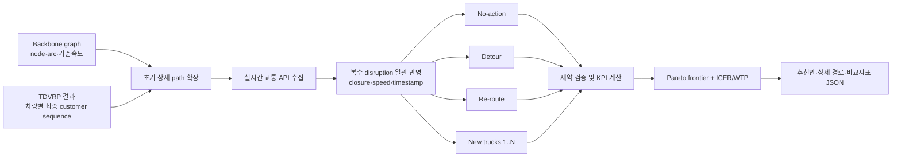
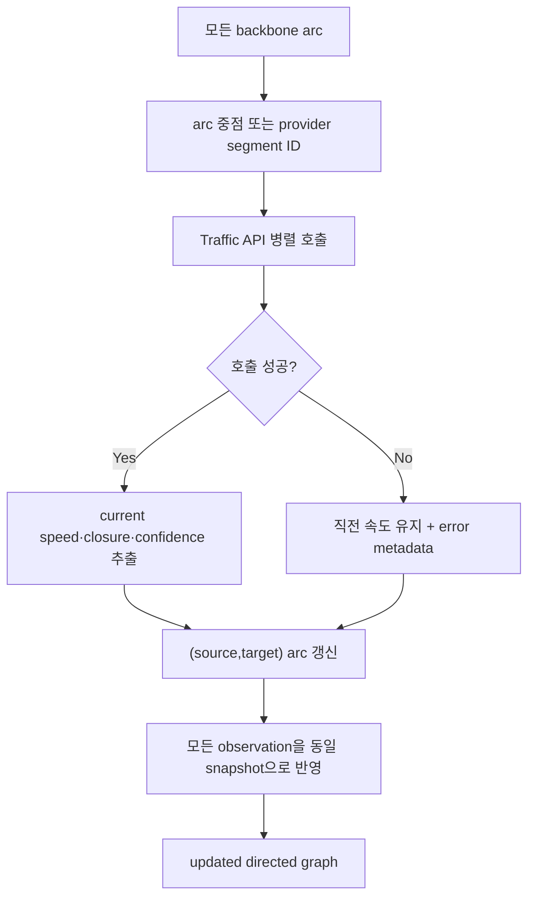
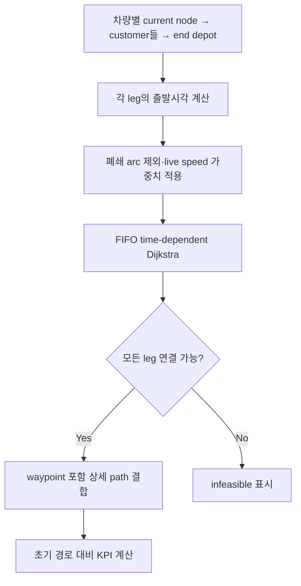
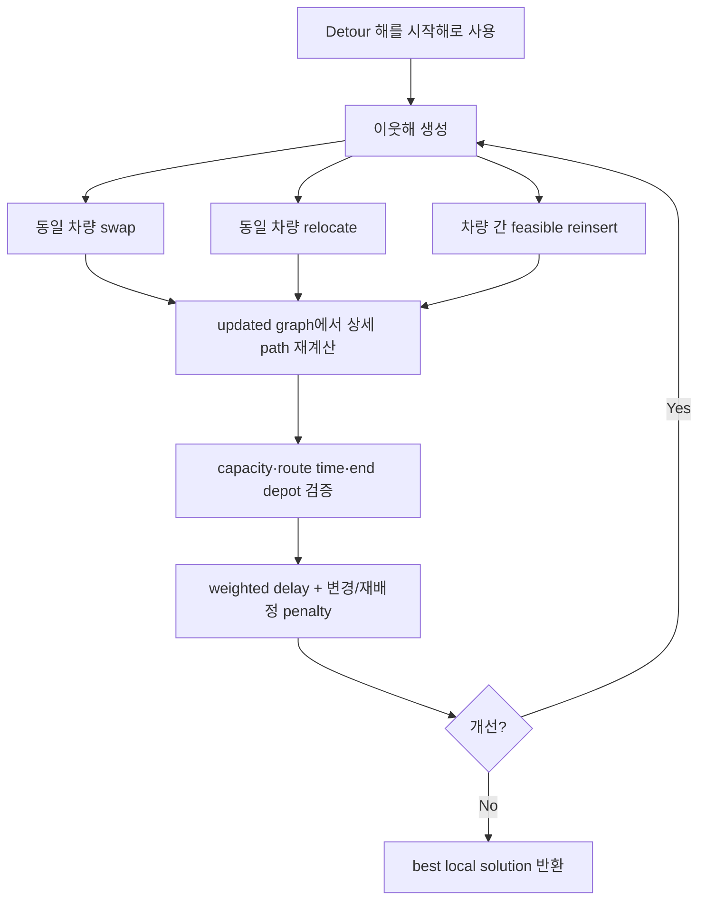
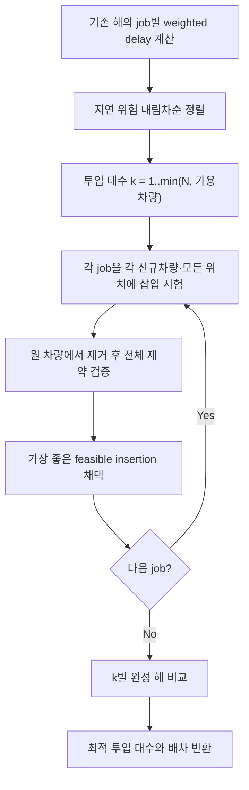

# Re-scheduling 알고리즘 및 연동 계약

## 1. 전체 파이프라인

TDVRP 최적화 자체는 이 저장소의 범위가 아닙니다. `routes[].stops`의 순서를 그대로 초기해로 받아, 교통 갱신 이전 backbone에서 각 service leg의 상세 path를 한 번 저장합니다.

## 2. 실시간 그래프 갱신

`traffic_snapshot.json`의 observation 여러 행은 동시에 발생한 장애를 뜻합니다. 존재하지 않는 arc observation은 무시합니다.

## 3. 방안별 알고리즘

### Detour — 고객 순서 고정, 도로 경로 우회

### Re-route — 고객 방문 순서/차량 배정 수정

### New trucks — 복수 신규 차량 투입

## 4. 입력 계약

### Backbone graph

- `nodes`: `id`, `lat`, `lon`, `kind(depot|customer|waypoint)`
- `edges`: `source`, `target`, `distance_m`, `base_speed_kph`
- 선택: `bidirectional`, `current_speed_kph`, `closed`, `metadata`

### TDVRP solution

- `vehicle`: `vehicle_id`, `current_node`, `end_depot`, `capacity`, `current_load`
- 선택 비용/시간: `available_at_s`, `max_route_time_s`, `fixed_dispatch_cost`, `cost_per_km`, `cost_per_hour`
- `stops`: 순서가 확정된 업무 목록
- stop의 `load_delta`: pickup은 양수, delivery는 음수
- stop의 `planned_arrival_s`는 초기해 대비 지연 계산 기준

## 5. 비교 지표와 추천

각 대안에 총 운행시간, 거리, 우선순위 가중 지연, 최대 지연, 지각 stop 수, 정시율, 운영비, 순서 변경 수, 재배정 job 수, 신규 트럭 수를 계산합니다. 지연·비용·거리·변경량에서 다른 해에 지배되는 대안을 제거하고, Pareto frontier에서 지연 1시간 절감 증분비용(ICER)이 사용자 WTP 이하인 대안을 추천합니다.

이 구조는 Karam & Reinau(2022)의 disruption 대응 프레임—accepting/no-action, detouring, rerouting, extra tractor—을 last-mile/customer-sequence 문맥에 맞게 확장한 것입니다.
