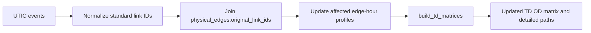
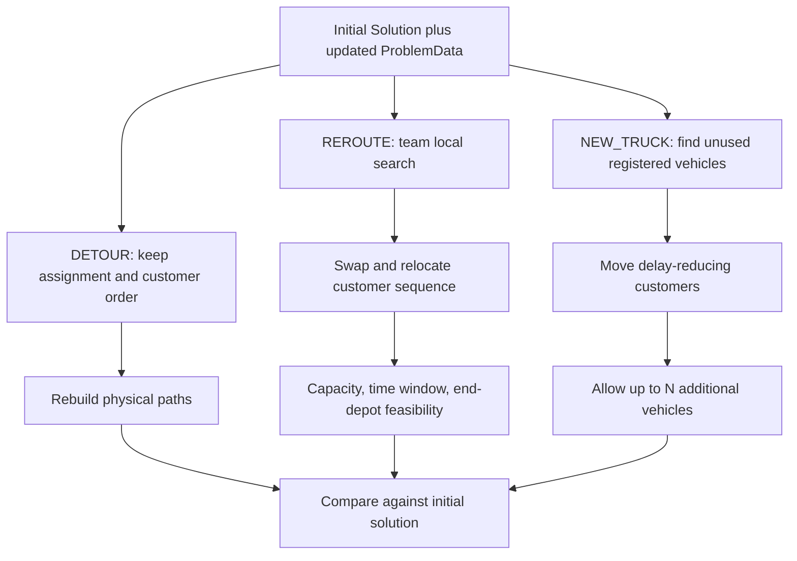

# Real-time re-scheduling algorithm flow

## Shared input contract

- Physical graph: `data/physical/physical_nodes.csv`, `physical_edges.csv`
- Hourly weights: `data/physical/edge_time_profiles.csv`
- Initial routes: ALNS/MILP `best_solution.csv`, converted to `src.model.solution.Solution`
- Fleet/capacity/time windows: `ProblemData.from_files()`
- Delivery only: each route starts with total assigned demand, and load decreases after delivery

## Graph update

Several closures or congestion events may be applied in one snapshot. A closure uses a large
travel-time multiplier so the shortest-path routine selects a feasible alternative whenever one
exists. If the traffic-flow API later supplies measured speeds, the provider only needs to emit a
normalized `TrafficEvent.speed_factor`; the graph-update and optimization layers do not change.

## Strategy flows

Reported comparison fields are total tardiness, travel time, distance, vehicle cost, used vehicle
count, changed positions, reassigned customers, new trucks, feasibility, and time/distance/tardiness
deltas against the initial network. The recommendation uses a transparent lexicographic order:
feasibility, tardiness, vehicle cost, travel time, distance, and finally operational change count.
